# 🏭 Obydullah Micro ERP

**A lightweight ERP system for small businesses — built entirely as a WordPress plugin.**

Contacts (CRM), double-entry accounting, HRM, and sales management, all inside your existing WordPress admin dashboard. No extra SaaS, no separate login, no per-user fees — just one plugin, one database, one dashboard.

[](https://wordpress.org/)
[](https://www.php.net/)
[](https://www.mysql.com/)
[](https://jquery.com/)
[](https://www.docker.com/)

[](https://www.gnu.org/licenses/gpl-2.0.html)
[](https://github.com/shaik-obydullah/micro-erp-wordpress-plugin)
[](https://wordpress.org/plugins/obydullah-micro-erp)
[]()
[]()

---

## ✨ Features

- 🧾 **Double-Entry Accounting** — chart of accounts, balanced journal entries, income & expense tracking, receivables and payables
- 👥 **CRM / Contacts** — customers, vendors, and suppliers with search and filtering
- 🧑‍💼 **HRM** — employees, departments, daily attendance grid, leave management, and monthly salary processing
- 🛒 **Sales** — quotations with one-click *quote → sale* conversion, sales orders with partial payments, and filtered reports
- 📆 **Fiscal Years** — manage multi-year books with independent, isolated journal entries
- ⚙️ **Settings** — company profile, currency symbol, and per-module defaults
- 📊 **Dashboard** — KPI cards, recent transactions, and quick business overview
- 🔐 **Secure by Default** — nonces, sanitization, prepared statements, capability checks, and a full audit trail

## 🚀 Quick Start (Docker)

```bash
# Clone and start the environment
git clone https://github.com/shaik-obydullah/micro-erp-wordpress-plugin.git
cd micro-erp-wordpress-plugin
docker compose up -d
```

| Service | URL | Credentials |
|---|---|---|
| WordPress | http://localhost:8010/wp-admin | `admin` / admin password from `docker-compose.yml` |
| phpMyAdmin | http://localhost:8011 | `root` / (no password) |

Seed demo data with WP-CLI:

```bash
docker compose run --rm --entrypoint /bin/sh wp-cli \
  -c "wp eval-file /var/www/html/wp-content/plugins/micro-erp/seed-demo-data.php --allow-root --path=/var/www/html"
```

## 📸 Screenshots

### Dashboard
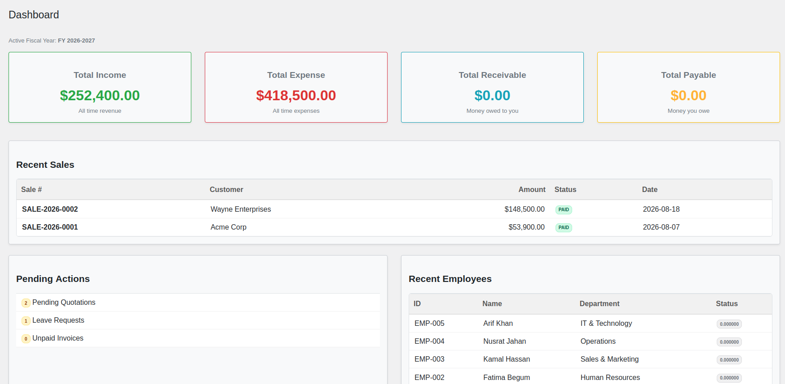

### CRM — Contacts
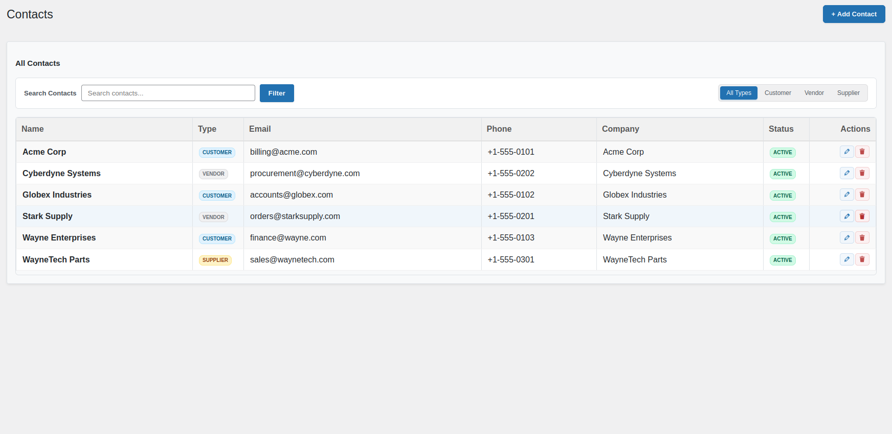

### Accounting
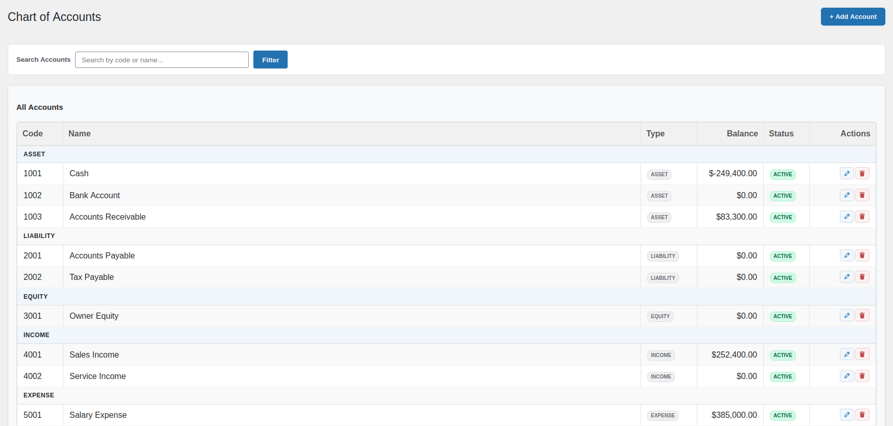

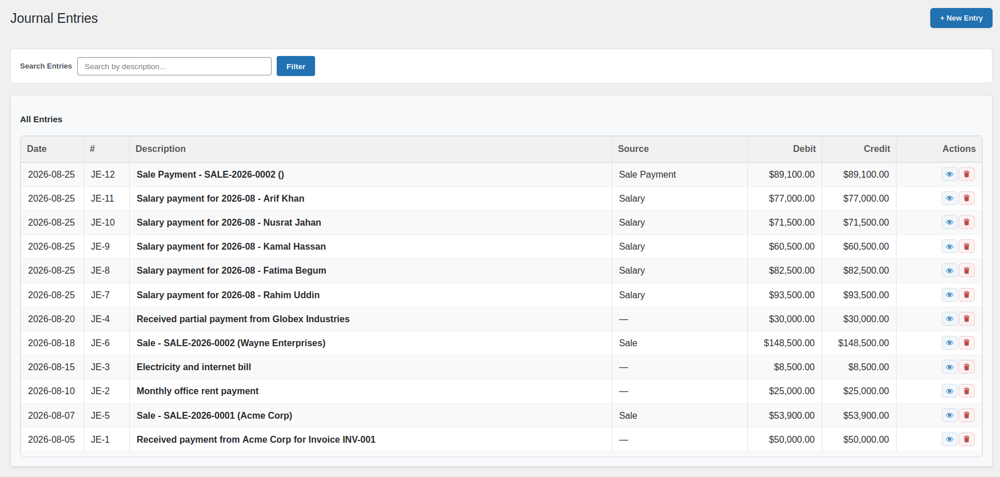

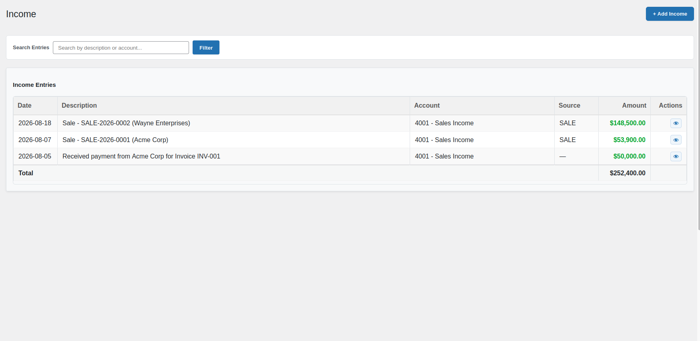

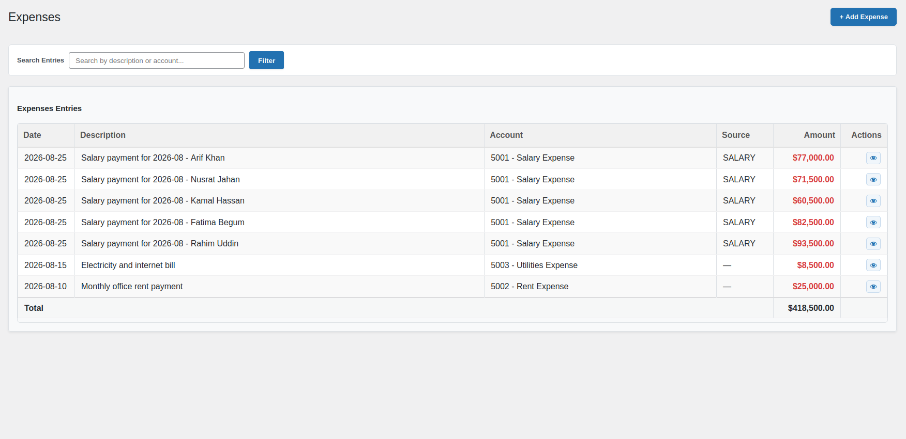

### HRM
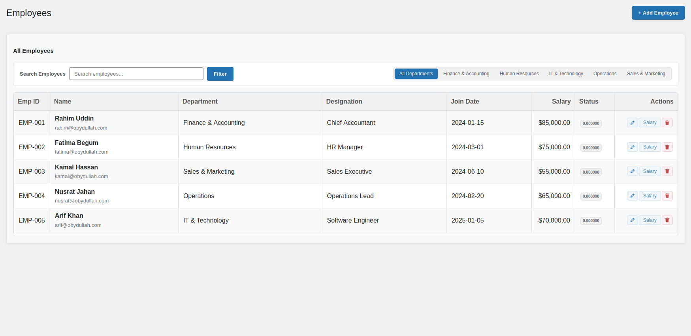

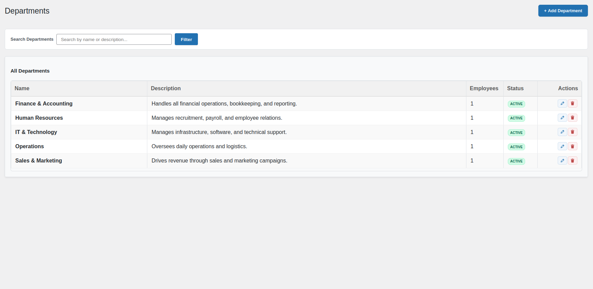

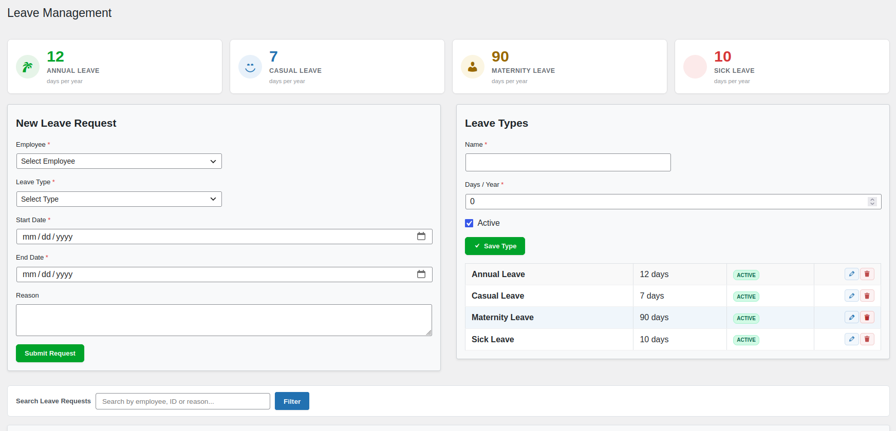

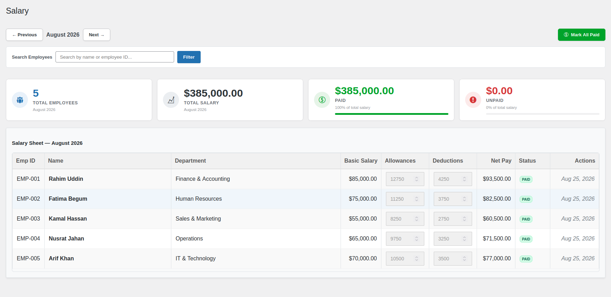

### Sales
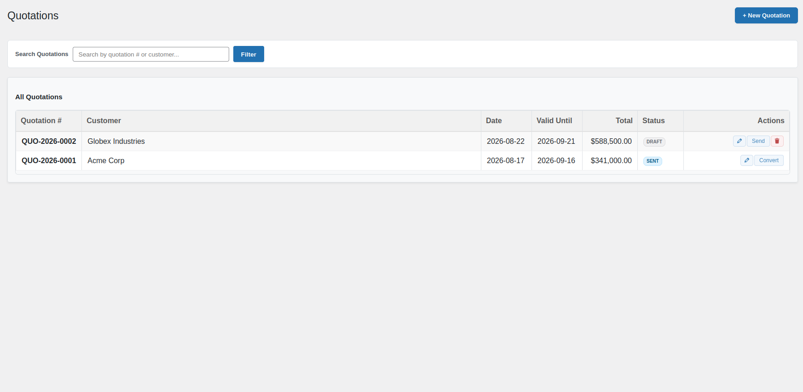

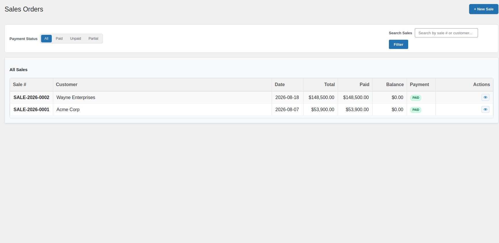

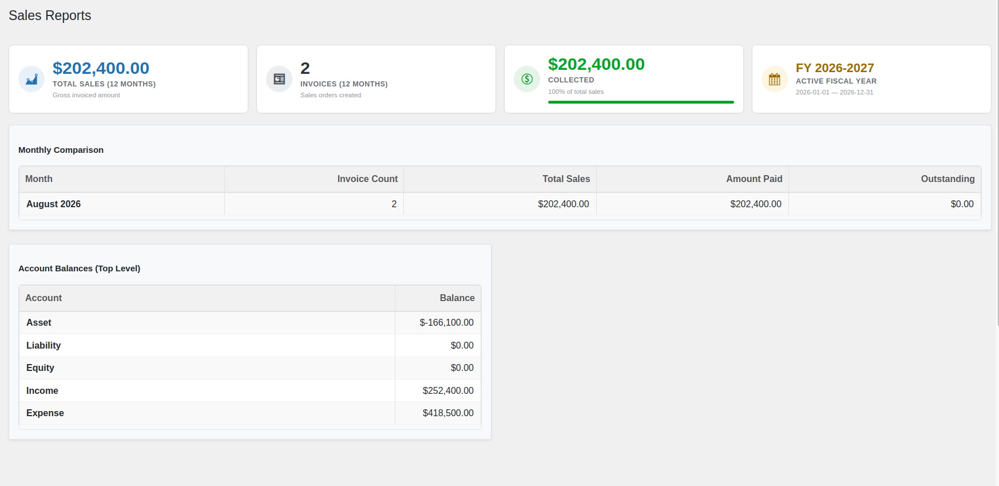

### Administration
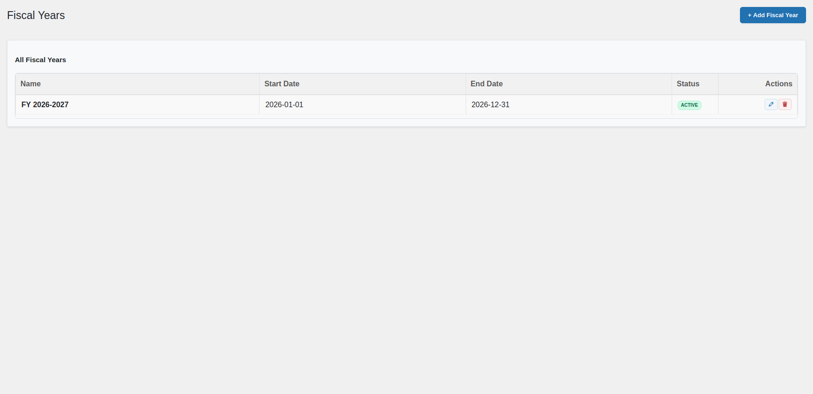

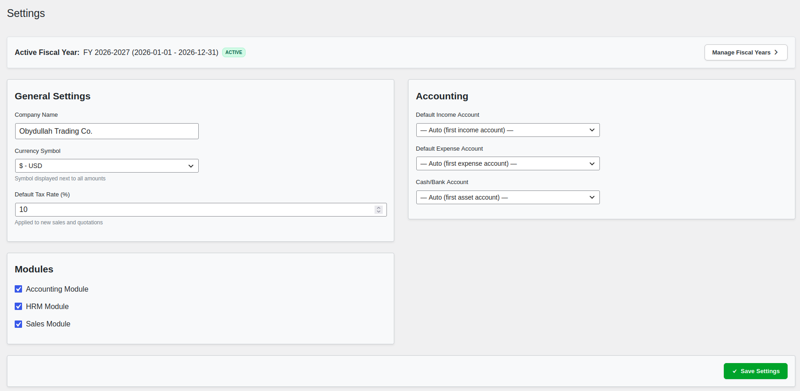

## 📦 Modules

| Module | Features |
|---|---|
| **Accounting** | Chart of Accounts, double-entry journal, quick income/expense, receivables, payables |
| **HRM** | Employees, departments, daily attendance, leave management, monthly payroll |
| **Sales** | Quotations, sales orders, payment recording, one-click quote-to-sale conversion |
| **CRM** | Customer / vendor / supplier directory with filtering and search |
| **Dashboard** | KPI cards, recent transactions, pending actions, quick overview |

## 🔌 Installation

1. Upload the `obydullah-micro-erp` folder to `/wp-content/plugins/`
2. Activate the plugin through the **Plugins** menu
3. Navigate to **Obydullah Micro ERP** in your admin menu

The plugin creates its own `oby_mi_erp_*` tables automatically on activation — no manual database setup required.

## 🛠 Tech Stack

| Technology | Usage |
|---|---|
| PHP 8.0+ | Backend logic, form handling, database queries |
| WordPress 6.0+ | Platform, admin UI, security APIs |
| MySQL 8.0 | 18 custom tables via `$wpdb` with prepared statements |
| jQuery | Client-side dynamic forms (journal balancing, line item calculator) |
| CSS3 | Custom admin framework (grid, cards, badges, tables, KPI, responsive) |
| Docker | 4-container development environment (WordPress + MySQL + phpMyAdmin + WP-CLI) |

## 🗄 Database Schema

18 tables with the `oby_mi_erp_` prefix, created via `dbDelta()` on activation:

| Module | Tables |
|---|---|
| Core | `fiscal_years`, `settings`, `audit_log` |
| CRM | `contacts` |
| Accounting | `accounts`, `journal_entries`, `journal_lines` |
| HRM | `departments`, `employees`, `attendance`, `leave_types`, `leave_requests`, `salary_payments` |
| Sales | `quotations`, `quotation_items`, `sales`, `sale_items` |

## 🧠 Accounting Rules

- **Double-entry enforcement** — every journal entry must balance (debit = credit); validated in real-time by JS and on the server
- **Normal balances** — debit-normal for assets/expenses, credit-normal for liabilities/equity/income
- **Automatic journal entries** — sale → *Dr Accounts Receivable / Cr Sales Income*; payment → *Dr Cash-Bank / Cr Accounts Receivable*; salary → *Dr Salary Expense / Cr Cash*

## 🔒 Security

- `ABSPATH` guards on every PHP file
- Nonce verification on all form submissions
- Input sanitization (`sanitize_text_field`, `sanitize_email`, `intval`, `floatval`)
- Prepared SQL statements (`$wpdb->prepare`)
- Output escaping (`esc_html`, `esc_attr`, `esc_url`)
- Capability checks (`manage_options`) on all pages
- Full audit logging of every create/update/delete operation

## 📄 License

[GPL-2.0-or-later](https://www.gnu.org/licenses/gpl-2.0.html) — free to use, modify, and redistribute.

---

_Built with WordPress, PHP, MySQL, jQuery, and Docker — by [Obydullah](https://obydullah.com)_